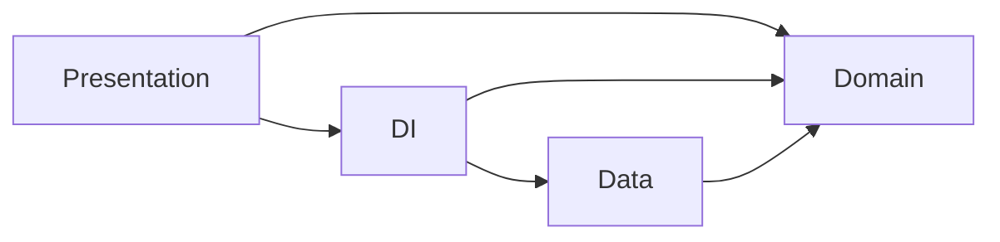

# Sample Android MVVM-Clean project

A sample project to show case MVVM-Clean with usecase implementation in android project, uses Hilt
for Dependency Injection and Retrofit for remote network calls.

## Project Details

The application presents sellers with a simple interface to sell their produce. They can sell their
produce in the city of their choice and each city would have a fixed rate for selling produce per
tonne. A loyalty factor would be applied on the final price that would `0.98` for non registered
sellers and `1.12` for registered ones if they insert their loyalty ids. Also, if the seller is
registered, the loyalty id will be filled automatically and vice versa. The cities list with their
fixed prices and registered sellers is received by calling apis :
>
sellers- https://gist.githubusercontent.com/akashraghav/6a614790ee36c699a2f344b90025caeb/raw/cb0cb2cf4bea01185e7dbfd37f23f5d6375600c7/sellers.json
>
cities- https://gist.githubusercontent.com/akashraghav/6a614790ee36c699a2f344b90025caeb/raw/cb0cb2cf4bea01185e7dbfd37f23f5d6375600c7/cities.json

## Code Structure

The repository code dependency structure as shown below :

* Presentation : Android components, UIs/Views, ViewModels and Utils (only Android/UI specific)
* DI (Dependency Injection) : Hilt Module containing objects required for injection in presentation.
* Data : model dtos, repository implementations, remote (as Data source)
* Domain : usecases, repository(interfaces), models, utils (only kotlin/lang specific)

## Code changes/requests

For Changes you can create an issue, or open pull requests.
For any suggestions, please send a [Tweet](https://twitter.com/metalheadakki).

Also Do leave a star to let me know if this was helpful.

MIT License
